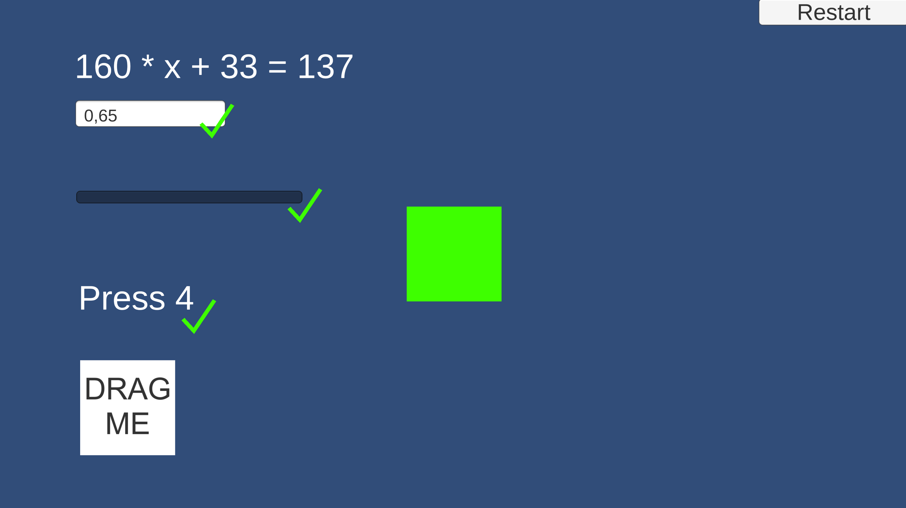

# conditions-seliskases

### Project description: 
Exercice for conditions: (A&&B) || (B&&C) || (C&&D)
A: 8)
B: 1)
C: 2)
D: 5)

### Development platform: 
Unity 2020.1.5, Visual Studio 2019

### Target platform: 
WebGL

### Visuals: 

### Project state: 
Finished

### Lessons Learned: 
Pointer Event data usage

Copyright by seliskases
